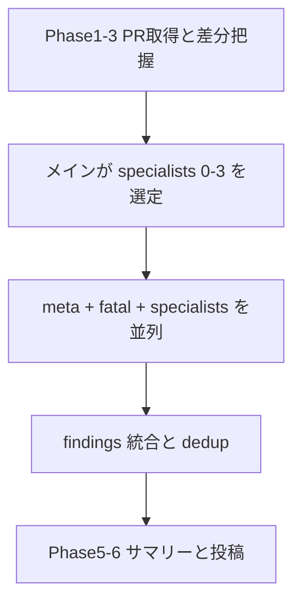

# pr-review: meta + fatal 固定と動的スペシャリスト

- 作成日: 2026-07-25
- 関連:
  - `shared/skills/pr-review/SKILL.md`
  - `shared/agents/meta-reviewer.md`
  - `shared/agents/fatal-reviewer.md`（新規）
  - `shared/rules/review-badges.md`
  - `shared/skills/consult-specialists/SKILL.md`（選定プール参照）

## 背景

`pr-review` は `meta-reviewer` / `pdm-reviewer` / `techlead-reviewer` の固定3体並列を前提にしていたが、後者2体のエージェント定義はすでに削除されており、スキル側だけが古いまま参照している。観点の固定分割は「毎回同じ3視点」になりやすく、差分の性質に合わないコストも大きい。

一方で方向性チェック（meta）と「マージしたら壊れるもの」の安全網は毎回欲しい。それ以外は内容に応じたスペシャリストに任せた方がよい。

## ゴール

- 毎回の固定レビュアーを `meta-reviewer` + `fatal-reviewer` にする
- メインが差分に応じて既存スペシャリストを 0〜3 体追加する
- マージブロック（`CHANGES_REQUESTED`）は `fatal` のみに限定する
- `pdm-reviewer` / `techlead-reviewer` 参照をスキル・バッジ定義から除去する

## ノンゴール

- `juggernaut` の復活やセルフレビュー統合
- スペシャリストエージェント本体の全面書き換え（呼び出し時の出力契約上書きで足りる）
- `review-acceptor` / `review-challenger` の復活
- project-scope レビューフローの変更

## 決定事項

| 項目 | 決定 |
|---|---|
| 固定メンバー | `meta-reviewer` + `fatal-reviewer` |
| fatal の範囲 | 本番破壊・権限漏洩等 + AC/契約の根本ズレ |
| 追加選定 | メインが既存12スペシャリストから 0〜3 体 |
| severity | `fatal` を新設（fatal-reviewer 専用） |
| 投稿 | `fatal` あり → `REQUEST_CHANGES`。`must` だけではブロックしない |

## アーキテクチャ

| 役割 | エージェント | いつ | severity |
|---|---|---|---|
| 方向性 | `meta-reviewer` | 毎回 | `must` / `suggestion` / `nit` / `good`（コードは見ない） |
| 致命 | `fatal-reviewer` | 毎回 | **`fatal` のみ** |
| 深掘り | 既存スペシャリスト | 0〜3 | `must` / `suggestion` / `nit` / `good` |

## fatal-reviewer

### 見るもの

PR diff（コード可）+ PR 本文 + 関連 Issue + 変更ファイル一覧。

### fatal の定義

含める:

- 本番・利用者を壊しうるもの（クラッシュ確実、データ破損、権限漏洩、破壊的マイグレーション、明らかなセキュリティ穴）
- 仕様の根本ズレ（AC 未達で機能が成立しない、既存 API/契約の破壊）

含めない:

- スタイル、命名、リファクタ提案、テスト不足単体、将来の負債懸念

迷ったら出さない（空配列）。

### 出力

meta と同じ JSON 骨格。`reviewer: "fatal-reviewer"`。`severity` は常に `"fatal"`。

`badge_label` 例: `本番破壊` / `権限漏洩` / `契約破壊` / `AC不成立`

## スペシャリスト選定

プールは `consult-specialists` の12体と同一。上限 0〜3。観点重複は代表1体。

目安（強制ではない）:

| 差分の兆し | 候補 |
|---|---|
| テスト / AC / 仕様 | `qa` |
| auth / 権限 / 秘密 / 公開 API | `safety-skeptic` |
| 障害・リトライ・監視・デプロイ | `failure-pessimist` |
| UI / 文言 / オンボーディング | `taste` or `friction-maximalist` |
| 大きな構造変更 | `architect` or `tech-lead` |
| 暫定フラグ・二重実装 | `debt-auditor` |
| 計測・ログ | `data-realist` |

呼び出し時は助言モード + findings JSON 必須を prompt で明示する。

スペシャリストが誤って `fatal` を返した場合は `must` に降格する（fatal は fatal-reviewer 専任）。

## 統合ルール

1. 完全重複 → `fatal` > `must` > `suggestion` > `nit`。同点は `fatal-reviewer` → `meta-reviewer` 優先
2. `fatal` と他の部分重複 → `fatal` を残し、必要なら rationale を追記吸収
3. `reviewer` フィールドは出所エージェント名を保持（バッジアニメ用）

## バッジ

| severity | color | フォールバック |
|---|---|---|
| `fatal` | `vivid-red` | `致命` |
| 他 | 現状維持 | 現状維持 |

| reviewer | animation プール |
|---|---|
| `fatal-reviewer` | `gatagata` → `shuchusen` → `bure` → `chuuou_zoom` |
| `meta-reviewer` | 現状維持 |
| スペシャリスト共通 | `yoko_scroll` → `mochimochi` → `bane` → `poyoon` |

## 投稿判定

- `fatal` あり → `REQUEST_CHANGES`
- `fatal` なし → `must`/`suggestion`/`nit` があっても原則 `COMMENT`、指摘が実質なく良い変更なら `APPROVE`
- 再レビュー表の「mustあり/なし」は「fatalあり/なし」に読み替え

## 実装で触るファイル

1. `shared/agents/fatal-reviewer.md`（新規）
2. `shared/skills/pr-review/SKILL.md`（Phase 4・投稿判定）
3. `shared/rules/review-badges.md`
4. `CLAUDE.md`（レビュー3体表の更新）
5. 本ドキュメント

## 成功条件

- `pr-review` が存在しない pdm/techlead を参照しない
- 毎回 meta + fatal が起動し、スペシャリストは差分に応じて可変
- GitHub 上で `CHANGES_REQUESTED` になるのは fatal findings があるときだけ
