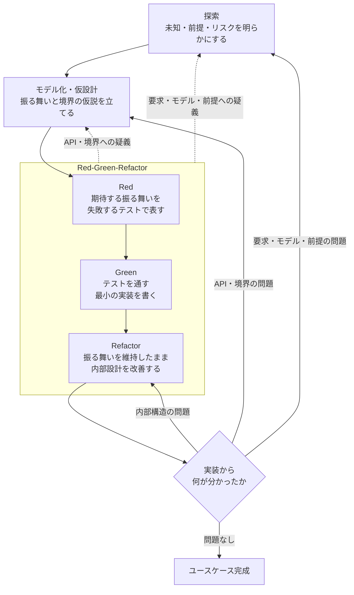

# code-complete — 開発ループのハブ

与えられた問題を解くコードを、以下のループに従って設計・実装する。一周目の探索・モデル化が出すのは実装で試す仮説であり、実装前に固める仕様ではない。仮説の正誤は Red-Green-Refactor が判定し、学習の段階で設計に還元する。

## 各段階と委譲先

このスキルはループの順序を守らせることだけに責任を持つ。各工程の規律・判断基準は担当スキルへ委譲する。

| 段階 | 担当スキル |
|------|-----------|
| 探索 | `/understand-problem`（問題定義）、`/explain-system`（既存の仕組み）、`/devise-plan`（解法戦略）。一周目は 5 要素だけを出し、全手順を通すのは戻ったとき、または小さく試せないときだけ |
| モデル化・仮設計 | `/design-code`（構造・型・データフロー・状態・エラー境界）、`/design-principles`（境界・結合・構造投資の理論）。一周目はその観点で仮説を 1〜2 行書くだけで、手順は通さず設計文書も作らない |
| Red-Green-Refactor | `/coding-standards`（TDD・テスト・実装の規律）。各単位を書く直前の境界・型・データフローは design-code の 5 観点で決める（その単位の分だけ） |
| 学習の判定 | `/design-principles`（結合・整理の経済学に基づく戻り先の判断） |

## 一周目に書く計画

一周目の探索・モデル化は、後の工程で読む人が使う次の要素だけを書いて Red に入る。判定器とスコープは項目ごとに 1 行、他の要素は 1〜2 行に収める。

| 要素 | 書くこと | 読み手 |
|---|---|---|
| 意図 | 誰が・どんな場面で・なぜ使うか。依頼に明示が無ければ「（推定）」を付ける | 完成後、条件は満たすが意図から逸れていないかの照合 |
| 仮説 | この境界・型・データフローで解けるはずだ、という見立て。決め打ちしている点だけを書く | 学習の段階。何が当たり何が外れたかを見比べる元 |
| 判定器 | 何を測って、どの値なら合格か。現在値と目標値。数値にできない条件は、欠陥を注入して落ちることを確かめる手順。自分の判断で置いた条件には「（推定）」を付ける | Red のテスト。完成の判定 |
| スコープ | 触るもの・触らないもの | 実装 |
| 未確認 | 実装が答えを出すはずの問い。推定で置いた条件を確かめる問いを含む | 学習の段階。埋めずに残す |

採用しなかった案の理由や手順の順序の根拠は、書き手しか読まないので、スキルの手順を通さない一周目には書かない。

`understand-problem` / `devise-plan` の手順を一周目に全部通さない。通すのは次のどちらかのときで、通した理由を計画に書く。`design-code` は、仮説に書く境界・型・データフローを決めるときと、各単位のコードを書く直前にそれを具体化するときの観点として使い、手順を全部通すのは境界・型への疑義でモデル化へ戻ったときだけにする。タスク全体の設計文書を一周目にまとめない。手順を通したスキルの出力は計画に足す。5 要素は手順を通さないときの形で、通した後の上限ではない。

- **ループが戻ってきたとき。** 要求・前提への疑義なら `understand-problem`、解法への疑義なら `devise-plan`、境界・型への疑義なら `design-code` を、その疑義に当たる節だけ通す。実装が出した疑義は机上の検討より具体的なので、ここで通したほうが問いが定まる
- **仮説を試す実装に時間がかかる、または取り返しがつかないとき。** 不可逆な変更（マイグレーション、外部への送信、公開 API や外部との契約、消したら戻らないデータ）や一周の実装が長くかかる見込み（例: 半日超）なら、机上で固めるのではなく小さく試す（使い捨てコピーでの予行、ハードコードで動く最小版、フラグで無効にしたまま入れる実装。目安は 1 時間以内に結果が出ること）。小さく試す形が作れないときだけ、着手前に `understand-problem` / `devise-plan` の手順を通す

## ループの運転

- 開始時に、上の4段階をセッションの計画に**そのまま**書き出す。タスク固有の項目より前に置く。飛ばす段階はリストから消さず `skip: <理由>` を付けて残す。黙って飛ばさない。計画ツールはエージェントに合わせる（Claude Code / Cursor: `TodoWrite`、Codex: `update_plan`）
- 上の4段階はセッションの工程リストで、一周目に探索・モデル化が出す成果物は「一周目に書く計画」の 5 要素。スキルの手順を通したときだけ、その出力を足す。段階の順序は崩さない
- **疑義が出たら一周の完了を待たず、その時点で該当する段階へ戻る**（API・境界への疑義 → モデル化、要求・モデル・前提への疑義 → 探索）。
- 疑義なく一周を終えても、必ず「実装から何が分かったか」を仮説と突き合わせて問う。問題なしと言えるまでループを抜けない
- 一周の内側は、確かめられる単位で進める。1つの変更、確認、次。似た編集をまとめて最後に一度確かめない。壊れたら、その単位まで戻る
- 渡すコミットの順も同じ単位にする。失敗するテストが先、修正が後。履歴を上から読むだけで、何が問題でどう直したかが分かる並びにする

## 判定テスト

- 「4段階すべてが計画に載っているか」— 載っていない段階に `skip: <理由>` が付いているか
- 「一周目の計画は、意図・仮説・判定器・スコープ・未確認に収まっているか。超えているなら、どのスキルの手順をなぜ通したか書いてあるか」— 書いていないなら、実装で試せることを机上で決めている
- 「`understand-problem` / `devise-plan` の手順を通したなら、どの疑義で戻ったか、またはなぜ小さく試せなかったかを言えるか」— どちらも言えないなら、手を動かせる仮説を机上で固めている
- 「今どの段階にいるか一言で言えるか」— 言えないなら順序が崩れている
- 「実装から何が分かったかを言えるか」— 仮説のどこが当たり、どこが外れたかを言えないまま次のユースケースに進んでいないか
- 「次の単位に進む前に、今の単位を確かめたか」— まとめて後で確かめていないか

## 報告に含めるもの

ループ一周ごとに: 立てた仮説 / 書いた失敗するテスト / 通した実装 / 実装から分かったこと（仮説のどこが外れ、設計に何を還元したか） / 次の一手。

委譲したスキルのうち、**判断を実際に変えたもの**を1つ挙げ、何がどう変わったかを一文で書く。挙げられないなら、そのスキルは読んだだけで適用していない。

## 次のステップ

ユースケースが完成したらコミットし、必要なら PR を作る。`git-commit` / `create-pr` があればそれを使い、無ければ `git commit` / `gh pr create` する。
