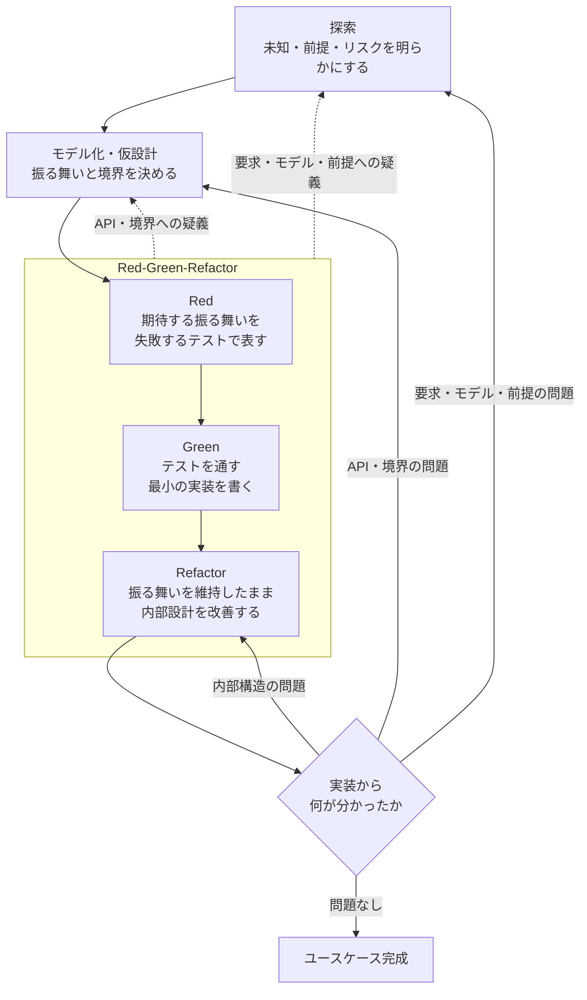

# code-perfection — 開発ループのハブ

与えられた問題を解くコードを、以下のループに従って設計・実装する。

## 各段階と委譲先

このスキルはループの順序を守らせることだけに責任を持つ。
各工程の規律・判断基準は担当スキルへ委譲する。

| 段階 | 担当スキル |
|------|-----------|
| 探索 | `/understand-problem`（問題定義）、`/explain-system`（既存の仕組み）、`/devise-plan`（解法戦略） |
| モデル化・仮設計 | `/design-code`（構造・型・データフロー・状態・エラー境界） |
| Red-Green-Refactor | `/coding-standards`（TDD・テスト・実装の規律） |
| 学習の判定 | `/design-principles`（結合・整理の経済学に基づく戻り先の判断） |

## ループの運転

- 開始時に、上の4段階を TodoWrite に**そのまま**書き出す。タスク固有の todo より前に置く。
  飛ばす段階はリストから消さず `skip: <理由>` を付けて残す。黙って飛ばさない
- 問題が小さく自明なら探索・モデル化は頭の中で済ませてよい。ただし段階の順序は崩さない
- **疑義が出たら一周の完了を待たず、その時点で該当する段階へ戻る**
  （API・境界への疑義 → モデル化、要求・モデル・前提への疑義 → 探索）。
- 疑義なく一周を終えても、必ず「実装から何が分かったか」を問う。問題なしと言えるまでループを抜けない

## 判定テスト

- 「4段階すべてが todo に載っているか」— 載っていない段階に `skip: <理由>` が付いているか
- 「今どの段階にいるか一言で言えるか」— 言えないなら順序が崩れている
- 「実装から何が分かったかを言えるか」— 言えないまま次のユースケースに進んでいないか

## 報告に含めるもの

ループ一周ごとに: 立てた仮説 / 書いた失敗するテスト / 通した実装 / 実装から分かったこと / 次の一手。

委譲したスキルのうち、**判断を実際に変えたもの**を1つ挙げ、何がどう変わったかを一文で書く。
挙げられないなら、そのスキルは読んだだけで適用していない。

## 次のステップ

ユースケースが完成したらコミットし、必要なら PR を作る。`git-commit` / `create-pr` があればそれを使い、無ければ `git commit` / `gh pr create` する。
