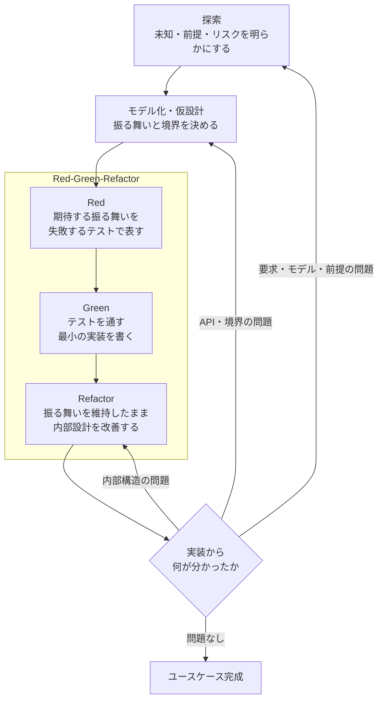

与えられた問題を解くためのコードを以下のフローに従って設計・実装するスキル。コードの設計判断を導く design-code と組み合わせて使うことを想定するが、単独使用も可。

```mermaid
flowchart TD
    A[探索<br/>未知・前提・リスクを明らかにする]
    B[モデル化・仮設計<br/>振る舞いと境界を決める]

    subgraph TDD[Red-Green-Refactor]
        C[Red<br/>期待する振る舞いを<br/>失敗するテストで表す]
        D[Green<br/>テストを通す<br/>最小の実装を書く]
        E[Refactor<br/>振る舞いを維持したまま<br/>内部設計を改善する]

        C --> D --> E
    end

    F{実装から<br/>何が分かったか}
    G[ユースケース完成]

    A --> B
    B --> C
    E --> F

    F -->|問題なし| G
    F -->|内部構造の問題| E
    F -->|API・境界の問題| B
    F -->|要求・モデル・前提の問題| A
```
