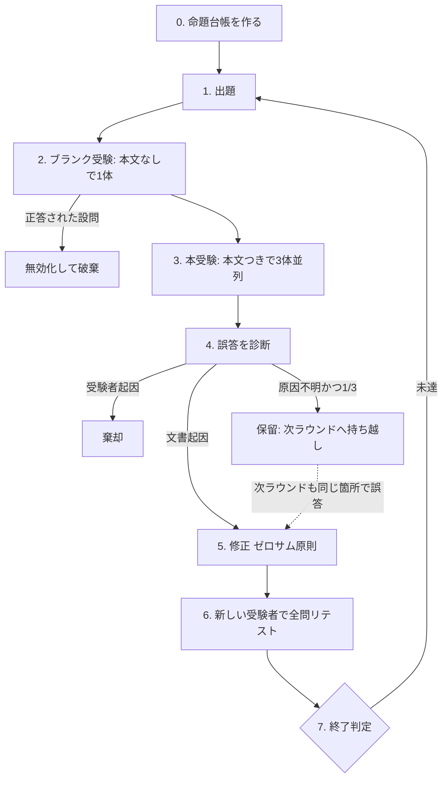

# Comprehension Test — 理解度テストによる文書改善

## 中核原理

**わかりやすさを自己評価しない。**

書き手は自分が何を言いたかったかを知っているため、文章がそれを伝えているかを判定できない（知識の呪い）。
読み手に「わかりましたか」と尋ねるのも無効で、追従バイアスにより「概ね明確です」が返る。

代わりに、**文脈を持たない受験者にクイズを解かせ、正誤という振る舞いで測る**。
誤答は「どこかがわかりにくい」ではなく「この命題が伝わらなかった」と欠陥を局所化する。
失敗するテストが原因箇所を指すのと同じ構造。

## 受験者の要件

受験者はサブエージェントとして起動する。4条件をすべて満たすこと。

| 要件 | 理由 |
|---|---|
| **その環境で最も弱く安いモデル**を明示指定する | 強いモデルは説明の穴を自分の知識と推論で埋めて読めてしまい、欠陥を隠す。弱いモデルは補償能力が低く、情報が足りない箇所でだけ失敗する |
| **本文をプロンプトに直接埋め込む**（ファイルパスを渡さない） | パスを渡すと周辺ファイルを読んで補完してしまう |
| **ツールを使わせない** | 同上 |
| **3体を並列**で、互いの答案を見せずに独立させる | 1体では誤答が文書の欠陥か受験者の失敗か切り分けられない |

モデルの参考値: Claude=`haiku` / Codex=`gpt-5.6-luna`（`-c agents.default_subagent_model` `-c model_reasoning_effort=low`）/ Cursor=`gpt-5.6-luna-low`。
起動方法は環境ごとに異なるが、**「サブエージェントで実行せよ」と指示すれば各エージェントが自前の機構に翻訳する**。CLI のフラグを抱え込まない。

## ループ

### 0. 命題台帳を作る

**本文からではなく「読者が知る必要があること」から命題を立てる。**
本文から出題すると、書かれていないことは質問すら生成されず、欠落が永久に検出されない。

| # | 伝えるべき命題 | 本文の該当箇所 | 状態 |
|---|---|---|---|
| 1 | … | L12-18 | 未検証 / 合格 / 欠陥 / 保留 / 無効 |

**該当箇所が空欄の命題は、その時点で欠落候補**。

### 1. 出題

- 命題1つにつき1問。**自由記述のみ**（選択式は消去法で当たる）
- 回答は3点セットで返させる: **答え / 根拠として引用した本文の一文 / 本文に無ければ「本文に記載なし」**

### 2. ブランク受験

**本文を渡さず、設問だけを1体に解かせる。正答できた設問は無効として破棄する。**

推測で当たる設問・訓練データの知識で答えられる設問・文脈汚染を、原因を問わず一つの振る舞いテストでまとめて排除できる。
特に、サブエージェントは親のプロジェクト指示（CLAUDE.md / AGENTS.md）を継承するため、
リポジトリ内の文書を検証すると受験者が本文ではなくプロジェクト文脈を根拠に正答しうる。この工程はその汚染も吸収する。

**破棄した設問は必ず作り直して補充する。** 破棄しただけでは、その命題は一度も検証されないまま残り、
検証範囲が痩せる。本文にしかない具体値・条件・例外を問う形に作り替え、再びブランク受験にかける。
設問文に答えを示唆する語を含めないこと（「揺らぎとして棄却してよいか」のような誘導は正答を誘発する）。

### 3〜4. 本受験と診断

**票数で切り捨てず、誤答の中身を読んで原因を切り分ける。**

| 誤答の様子 | 判定 |
|---|---|
| 引用箇所は正しいが解釈を誤った | **文書の欠陥**（1/3でも採用） |
| 「本文に記載なし」と回答 | **欠落**（揺らぎでは出ない強いシグナル） |
| 引用が本文に存在しない（幻覚）／設問と無関係な答え／形式崩れ | **受験者起因**（3/3でも棄却） |

票数は棄却の道具ではなく、優先度と踏み込み度に使う。

| 票数 | 対応 |
|---|---|
| 3/3 誤答 | 構造的欠陥。書き足しではなく**書き直し**を検討 |
| 2/3 誤答 | 直す |
| 1/3 誤答 | 原因が本文に特定できるなら直す。できなければ**保留**にして次ラウンドへ持ち越す |

**1/3 を「揺らぎ」として棄却してはいけない。** 実際の読者は多数決で理解しない。
3体中1体が誤読したなら、それは読者のおよそ1/3が誤読する文章であり、十分に欠陥である。
独立した受験者で2ラウンド連続して同じ箇所に誤答が出たら、保留を欠陥に昇格させる。

### 5. 修正 — ゼロサム原則

**修正後の総文字数が修正前を超えないこと。** 増やすなら他を削って相殺する。

誤答のたびに説明を書き足すとクイズに過適合して文書が膨らみ、読みやすさはむしろ下がる。
誤読を招いた記述は、足すのではなく**書き直す**のが原則。文章表現の推敲は natural-writing に委譲してよい。

### 6〜7. リテストと終了判定

リテストは**新しい受験者で全問**やり直す（直した箇所だけでは、修正が別の箇所を壊したことに気づけない）。

次のいずれかで終了する:

- 全問正解（保留ゼロ）
- 2ラウンド連続で新規の欠陥ゼロ
- 3ラウンド到達（**未解決の欠陥と保留を明示して報告**する。黙って打ち切らない）

## 危険信号 — 一つでも当てはまれば測定は無効

- 受験者が強いモデルである／ツールを持っている／本文をパスで渡した
- 設問を本文から作った（欠落を永久に見逃す）
- ブランク受験を省いた、または破棄した設問を補充しなかった
- 直した箇所だけリテストした

## 台帳と答案の置き場

スクラッチパッド等の作業領域に置き、**コミットしない**。成果物は改善された文書そのもの。
