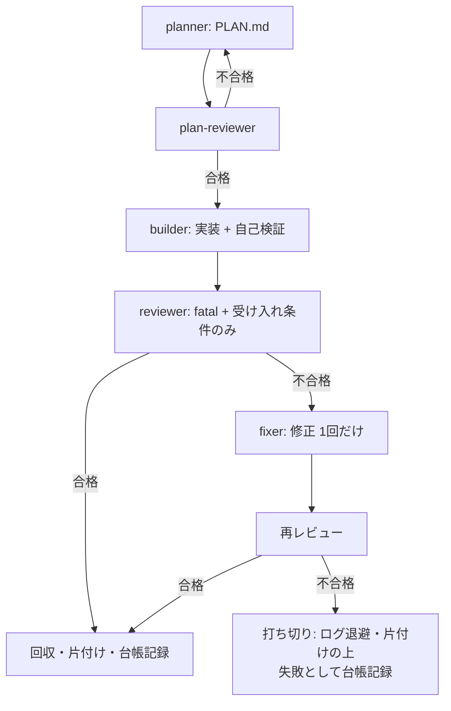
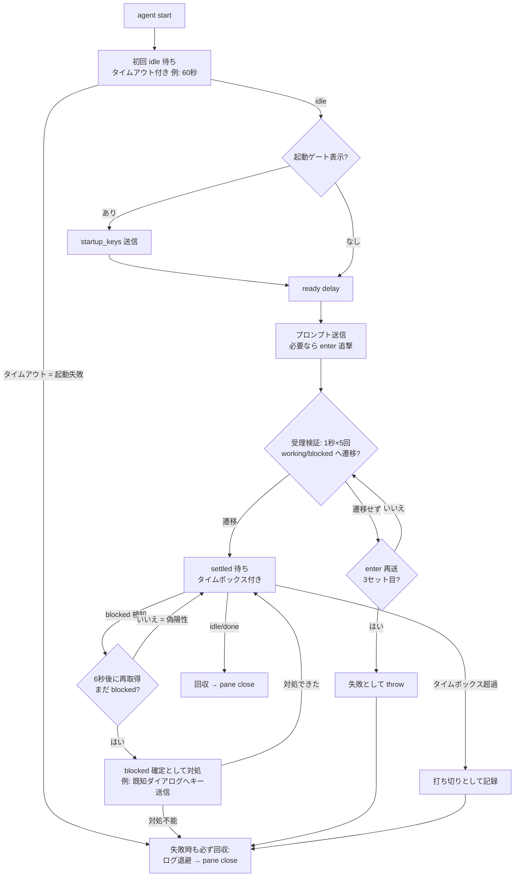

# Herdr マルチエージェント開発

## 概要

自分（メインエージェント）が指揮者となり、Herdr ペイン内で別のエージェント CLI（cursor-agent / codex / claude）を起動・操縦して、役割分担で開発を回す手法。核心は3つ:

1. **クロスレビュー**: builder と reviewer は別ベンダーのエージェントに割り当てる。異種モデルは盲点が重なりにくく、品質ゲートの独立性が上がる
2. **プロンプト契約**: 各役割に作業ディレクトリ・限定スコープ・機械可読な完了報告を義務付ける
3. **防御的操縦**: TUI への入力は黙殺されうる前提で、送信→受理検証→完了待ちの各段に検証を挟む

**REQUIRED BACKGROUND:** herdr スキル（CLI 操作の正本）。開始前に `test "${HERDR_ENV:-}" = 1` を確認する。

## When to Use

- 実装とレビューを別エージェントに分担させたい（クロスレビュー）
- 複数エージェントを並列・逐次に操縦する半自動〜無人のパイプラインを組みたい
- **使わない**: Herdr 外での並列作業は Task/サブエージェントを使う

## 役割設計

| 役割 | 担当 | スコープ |
|---|---|---|
| commander | 自分の代役（claude 上位モデル。委譲時のみ） | パイプライン全体の操縦（下記フローの実行主体） |
| planner | 自分（または claude 上位モデル） | アイデア→受け入れ条件付き計画（PLAN.md） |
| plan-reviewer | planner と別エージェント | 受け入れ条件の検証可能性・スコープ妥当性のみ |
| builder | cursor 等 | 計画に沿った実装 + 自己検証 |
| reviewer | builder と別エージェント（codex 等） | fatal 問題 + 受け入れ条件の未達のみ。スタイル指摘禁止 |
| fixer | builder と同系 | 不合格時の修正。**1回だけ** |

パイプラインの制御フロー（分岐と終了条件はこの図が正本。fixer 後の不合格は無条件で打ち切り）:



- 役割→「エージェント+モデル」の割当リストを設定に持ち、先頭が主担当・以降フォールバック。クレジット系エラー（`credit balance` / `usage limit` / `rate limit`）を検出したら次候補で再実行
- **審査系の役割（plan-reviewer / reviewer）は非対話モードを既定にする**。`opencode run --dir <dir> -m <model> "<prompt>"` は TUI を起動せず1回の実行で完結し、出力が stdout にそのまま出る。ペイン作成・起動ゲート・ready delay・enter 追撃・受理検証・状態ポーリング・折返しの復元がすべて不要になり、判定行のパースも確実になる。**Herdr ペインで動かす価値があるのは builder / fixer** — 実装中の様子を観察・介入したい役割だけ
- **フォールバック時は前任が追っていた線を後任へ引き継ぐ**。中断は途中まで進んだ調査を持っているので、判定が出ていなくても「どこまで確認済みか」「中断直前に何を追っていたか」を回収して後任のプロンプトに載せる（実測: 引き継いだ線がそのまま不合格の根拠になった）。引き継ぎは時間配分の参考として渡し、後任自身の検証を省かせない
- **役割ごとに `herdr tab create --workspace <自分のID>` で単独ペインのタブを使う**。同じタブを `pane split --direction right` で分割し続けると幅が狭まり、herdr の画面検知が外れて `agent_status` が working を idle と誤報する。誤報が疑われるときは画面に停止案内（`ctrl+c to stop` 等）が出ているかで判定する
- **狭さの上限はターミナルウィンドウの幅であって、herdr の分割ではない**。`herdr pane layout --pane <id>` の `area.width` で実測できる。単独ペイン（`splits: []`）なら `pane resize` も `pane zoom` も効かない（zoom は `reason: "single_pane"` で無反応）。ウィンドウが狭い環境では、エージェント TUI がその幅でハード折返しした出力は `--source recent-unwrapped` でも復元できない（結合されるのはソフト折返しだけ）。判定行の契約は末尾行なので生き残るが、理由の本文は読めなくなる。空白を伴う改行を結合する後処理を挟むか、herdr スキルのファイル出力フォールバックを使う
- **他セッションと同居する前提で名前空間を分ける**。Herdr は複数の開発セッションが相乗りするので、次の2つを必ず守る（どちらも実測で事故になった）:
  - **`--workspace` を省略しない**。省略すると別セッションのワークスペースにタブが作られる。自分のIDは `herdr agent list` で自分のペイン（自分のセッションのタイトルが出ている行）から確認する
  - **エージェント名にプロジェクト接頭辞を付ける**（`kojo-builder` / `kojo-reviewer`）。herdr のエージェント名はグローバルで、`builder` `reviewer` のような一般名は他セッションと衝突する。`[a-z][a-z0-9_-]` の32文字以内に収める
  - 起動前に `herdr agent list` を見て、同名の他セッション由来のエージェントが居ないことを確認する
- 軽い役割は安価なモデルに落とす（例: バックログ補充は sonnet）
- **「やめる判断」ができることが無人運用の品質担保**。打ち切りは失敗ではなく正常な終了経路として台帳に記録する

### 指揮の委譲（commander）

指揮の仕事（本パイプラインの操縦）自体を別エージェントに委譲できる。自分は commander を1ペイン起動してタスクと契約を渡し、settled を待って回収するだけになる。

- commander は Herdr ペイン内で動くため `HERDR_ENV=1` は満たされる。herdr CLI を Bash で実行するため無人フル権限が必要（roles の `extra_args` 上書きで付与。codex はサンドボックスが外部プロセス起動を遮断するため候補にしない）
- 契約: 本スキルに従って操縦・台帳記録し、最終行に「完了」または「打ち切り」の独立行で報告する（「合否判定の機械化」と同じパース規則で回収する）
- **入れ子禁止**: commander がさらに commander を起動しない（委譲は深さ1固定）
- フル権限で動くぶん、渡すタスクの作業ディレクトリとスコープは通常の役割より厳密に切ること
- **1 発注 = 1 フェーズに切る。** 全工程を 1 回の settled 待ちに載せると、どのタイムボックスも
  超えるうえ、途中で照合する材料が無い。委譲側はフェーズの合間に**自分の環境でゲートを実測**して
  合否を確定する（`code-perfection-multiagent` が指揮者に課す義務が、ここでは委譲側に落ちる）
- **進捗を永続化させる。** 計画のチェックボックスと台帳をコミット・追記させておけば、
  commander が死んでも途中から再開できる。実測（2026-08-24）: commander が context 100% に
  達したので、契約書・台帳・チェックボックスを資材に**2 代目へ載せ替えて完走**した。
  載せ替えの直前に、契約書に無い実測知（踏んだ罠・再利用できる道具・保留事項）だけを
  申し送りに書かせる — 台帳に在ることを書き写させない
- **申し送りの更新はフェーズ完了報告の必須項目にする。** 「context が閾値を超えたら書く」では
  間に合わない — 重いフェーズ 1 本で閾値を飛び越え、申し送りを書けないまま停止しうる。
  毎フェーズの報告に含めさせるほうが、閾値を監視するより確実で安い

### エージェント・モデルの設定（正本: 同梱の `agents.yaml`）

割当の正本は**本スキルと同じディレクトリの [agents.yaml](agents.yaml)**（ユーザー全体設定。スキルと一緒に全ツールへ配布される）。プロジェクト直下に `agents.yaml` があればそちらを優先する（プロジェクト上書き）。

形式は、エージェント定義（CLI差分の吸収）と役割割当（誰がどのモデルでやるか）の二層:

```yaml
agents:
  <名前>:
    cmd: <CLI実行名>
    model_flag: "--model" | "-m"
    effort_args: [<argvテンプレート>]     # 省略可。{effort} を roles の effort 値で置換
    default_model: <モデル名>
    extra_args: [<無人化フラグ>]          # プロファイル表参照
    credit_error_patterns: [<パターン>]   # フォールバック発動の判定
    interaction:                          # 操縦の癖（プロファイル表と対応）
      ready_delay_ms: <ms>
      enter_chaser: true|false
      startup_gate_pattern: <起動ゲートの正規表現>
      startup_keys: [<送信キー>]
roles:
  <役割>:   # 先頭が主担当、以降フォールバック順
    - { agent: <名前>, model: <上書きモデル>, effort: <推論努力>, extra_args: [<上書きargv>] }   # model 省略時は default_model。effort / extra_args は任意
```

起動 argv への展開規則: `<cmd> <model_flag> <model> [<effort_args...>] <extra_args...>`。effort_args は roles のエントリに `effort` がある場合だけ挿入し、`{effort}` をその値で置換する（effort_args を持たないエージェントへの effort 指定は無視。cursor は effort をモデル名で表現する — プロファイル表参照）。roles のエントリに `extra_args` がある場合はエージェント定義の extra_args を**丸ごと置換**する（マージしない）。例えば builder の主担当（cursor / cursor-grok-4.5-high の場合）は:

```bash
herdr agent start builder --cwd <dir> --split right --no-focus -- \
  cursor-agent --model cursor-grok-4.5-high --force
```

台帳（ログ）には「どの役割をどのエージェント+モデルが担ったか」を毎回記録する — エージェント別成功率の比較データになり、割当の見直し根拠になる。

### 設定のカスタマイズ

設定は次の順で探し、**最初に見つかったファイルを丸ごと使う**（キー単位のマージはしない。使うファイルに `agents` と `roles` を完全に書くこと）:

1. プロジェクト直下の `agents.yaml` — そのリポジトリ専用の割当
2. 本ディレクトリの `agents.local.yaml` — **マシン固有の上書き（git 管理外）**。環境に合わせた変更はここに書けば、共通既定に差分を出さずに済む
3. 本ディレクトリの `agents.yaml` — 全マシン共通の既定（バージョン管理される正本）

- 全マシン共通で変えたい割当（開発方針の変更）だけを `agents.yaml` に入れ、マシン依存の値は `agents.local.yaml` へ。環境依存なのは主に `agents` 節: インストール済み CLI、利用可能モデル、クレジット状況、無人化フラグの挙動
- ローカル上書きを作るときは `agents.yaml` をコピーして必要箇所だけ変えるのが早い（全体置換のため）
- 新しいマシン・CLI更新時は値を書き写さずに**実測して更新する**: 各 CLI の存在と版、モデル候補（`cursor-agent --list-models` 等）、無人化フラグ・起動ゲートの実挙動

## セッションライフサイクル

1セッション = 起動→送信→完了→回収→片付け。各段に検証を挟む。

以下のコマンド列は Herdr 0.7.5 実測時の構文（2026-08-02）。0.7.5 ではペインとエージェントが独立し、先にペインを作ってから起動する2段構成になった。バージョンで構文が変わるため、**実行前に必ずインストール済みバイナリの help で現行構文を確認する**（正本はバイナリ）。手順の骨格と防御層はどの版でも変わらない:

```bash
# 1. ペイン作成（応答 JSON の .result.pane.pane_id を次で使う）
herdr pane split --current --direction right --cwd <dir> --no-focus
# 2. 起動（--kind が実行ファイルを決めるため native args に実行ファイル名は含めない。
#    agent start は入力可能になるまで待ってから返る。失敗時は pane close で片付ける）
herdr agent start <name> --kind <kind> --pane <pane_id> --timeout 60000 -- <flags...>
# 3. 起動ゲート処理: 画面をポーリングし、信頼確認ダイアログが出ていたらキー送信
herdr agent read <name> --source recent-unwrapped --lines 40   # パターン照合→ send-keys
#    （起動直後は recent-unwrapped が空を返すことがある → --source visible にフォールバック）
# 4. ready delay を置いてからプロンプト送信（+ プロファイル表に従い enter 追撃）
herdr agent prompt <name> "<prompt>" --wait --timeout <ms>
# 5. working への遷移を検証（受理確認）
# 6. settled 待ち（idle/done = 完了、blocked はデバウンス後に確定）
# 7. 回収して片付け
herdr agent read <name> --source recent-unwrapped --lines 200
herdr pane close <pane_id>   # 失敗時はログ退避後に閉じる
```

防御層を含めた制御フロー（分岐と終了条件はこの図が正本）:



成功・失敗どちらの終端でも回収と pane close を必ず通す。失敗経路の回収を省くとペインが残留し、原因調査に必要なログも失われる。

防御層の実測根拠（これを省くと無反応セッションの黙殺や誤判定が起きる）:

- **受理検証（ensureWorking）**: 送信後 1秒×5回 working/blocked への遷移をポーリング。遷移しなければ enter を再送、3セット試してだめなら失敗として throw。「送ったのに何も起きない」の黙殺防止
- **blocked デバウンス**: Herdr の blocked 検知には偽陽性がある。検知後 6秒おいて再取得し、まだ blocked なら確定
- **settled 待ちの早期リターン**: `agent wait`（settled 待ち）は作業中エージェントの短時間の状態揺れで早期リターンすることがある（0.7.5 / cursor で実測。blocked と返しつつタイトルは Working のまま等）。完了確定は「idle 検出 → 6〜8秒おいて再取得してまだ idle」のデバウンス付きポーリングで行う
- **タイムボックス**: セッション待ちに上限（例: 2時間）を必ず設定。超過は打ち切りとして記録
- `agent prompt --wait` を持つ版ではそれを優先してよい（atomic 送信 + stall 検出内蔵）。ただし起動ゲートと起動直後の入力消失、**cursor の Enter 未消費**はエージェント側 TUI の癖なので、送信手段によらず下表の対処が必要

## エージェント別プロファイル（実測: Herdr 0.7.5 / 2026-08-02。claude 行のみ 0.7.4 / 2026-07-30 実測のまま）

| エージェント | 無人化フラグ | 起動ゲート | 送信の癖 |
|---|---|---|---|
| cursor-agent | `--force` | Workspace Trust ダイアログ。**`--force` では抑止されない** → キー `a` を送信（信頼済みワークスペースでは出ない） | **0.7.5 の atomic な `agent prompt` でも Enter は消費されない**（入力ボックスに Pasted text として残り idle のまま）→ 送信 3〜4 秒後に `agent send-keys <name> enter` の追撃が必須。ready delay 3秒 |
| codex | `-a never -s workspace-write` | なし | **TUI 起動直後に送ったプロンプトは消える** → idle 判定後（0.7.5 では `agent start` の復帰後）さらに 5秒待って送信。0.7.5 の `agent prompt` なら enter 追撃は不要（実測3セッション連続で受理）。**`agent prompt --wait` は受理されていても状態遷移を検知できず timeout エラーを返すことが多い**（2026-08-02 実測: 1セッション内でほぼ毎回）→ --wait の結果を成否判定に使わず、送信後に working 遷移の受理ポーリング（1秒×5回）で確認する |
| claude | `--permission-mode auto` | `Do you trust the files in this folder` → enter で既定選択 | ready delay 3秒。追撃不要 |

- モデル指定フラグ: cursor `--model`（候補は `cursor-agent --list-models`）/ codex `-m` / claude `--model`
- effort 指定（実測 2026-08-09）: claude `--effort low|medium|high|xhigh|max`（2.1.226）/ codex `-c model_reasoning_effort=<値>`（0.147.0。high のみ実測）/ cursor は独立フラグ無し — モデル名（`cursor-grok-4.5-high` 等）か bracket 構文（`'claude-opus-4-8[effort=high]'`）で表現
- codex は状態行に使用量残量（`weekly N% left`）を表示する — フォールバック判定の補助材料
- codex はサンドボックス外コマンドで本物の blocked（承認UI）になる。無人運用では `-a never` が必須
- **バージョン更新時は再測定すること**（癖は非公開仕様であり変わりうる）

## 同梱の道具（[tools/](tools/)）

毎セッション書き直していたものを実測済みの形で置いてある。パスは焼き付いていない。

| | |
| --- | --- |
| `verdict.py <log>` | 判定行を**末尾から**走査して取り出す。プロンプトのエコーを拾わない（下記の独立行契約の実装） |
| `wait-verdict.sh <log> [timeout] [quiet]` | 非対話セッションの完了待ち。判定行の出現とログの静止の両方を見る |
| `wait-settled.sh <agent> [timeout] [debounce]` | herdr ペインの完了待ち。idle / blocked をデバウンスする |
| `make-review-copy.sh <dir> <PLAN.md> [files...]` | reviewer の使い捨てコピーを作る。`EXTRA_FROM_GIT` で作業ツリーに無いファイル（他 ref の spec 等）も同梱できる |

## 合否判定の機械化（独立行契約）

reviewer への契約: 「最終行に必ず『合格』または『不合格』**とだけ**書く。不合格の場合はその前に理由を箇条書き」。

パース側は**下の行から走査**し、装飾を除いて判定語のみの行だけを判定とみなす:

```typescript
// 行中に判定語を含む文（送信プロンプト自体の画面エコー等)は判定として扱わない
const VERDICT_LINE = /^[•\-*\s]*(不合格|合格)[。．\s]*$/;
// 出力を末尾行から上へ走査し、最初に一致した行で判定。一致なしは「判定不明」= 不合格扱い
```

`grep <トークン> | tail -1` による部分一致は禁物: 送信したプロンプト（判定語の説明を含む）が画面にエコーされ、それを拾って誤判定する。

## プロンプト契約の型

```
あなたは <役割> です。作業ディレクトリ: <絶対パス>
<やることを1文で>
ルール:
- <スコープの限定・禁止事項>
- 完了前に <検証コマンド> を実行して通ることを確認
完了したら「<完了トークン or 合否の独立行>」と報告してください。
```

要点: 作業ディレクトリを明記（相手の cwd を信用しない）/ スコープを狭く切る / 自己検証を義務付ける / 報告は機械可読に。エージェント横断の共通指示は `AGENTS.md` に一本化し、`CLAUDE.md` は `@AGENTS.md` インポートのみにする。

**発注はファイルに書き、ポインタだけ送る。** プロンプト本文をシェルの文字列に埋めると、
バッククォートが**コマンド置換として実行される**。実測（2026-08-24）: 発注に
`` `pnpm build && pnpm verify:build` `` と書いたところビルドが実走し、その出力が
プロンプトに混入したうえでバッククォート部分のコード片が欠落したまま相手に届いた。
壊れたことは送信側の戻り値には出ず、**受け側の画面を読んで初めて分かる**。

```bash
cat > <scratch>/PHASE7.md <<'EOF'   # 引用ヒアドキュメント。中身は展開されない
...発注の全文（コード片・パス・記号を自由に書ける）...
EOF
herdr agent prompt <name> "発注を <scratch>/PHASE7.md に置きました。読んで着手してください。"
```

## よくある失敗

| 症状 | 原因と対処 |
|---|---|
| 送ったのに何も起きない | TUI が入力を黙殺。working 遷移を検証し、来なければ enter 再送。3回でエラー化 |
| `agent start` が invalid_agent_name で失敗 | エージェント名は `[a-z][a-z0-9_-]` の**32文字以内**（herdr の制約）。日付+アプリ名などの連結で超えやすい。直列実行なら名前からコンテキスト固有部を落として再利用してよい（同名残骸は起動前 close で回収） |
| blocked と出たが動いている | 検知の偽陽性。6秒後に再確認してから対処 |
| 合否が常に同じ値になる | プロンプトのエコーを拾っている。独立行契約 + 末尾から走査に切替 |
| 長い出力が途中から読めない | alternate screen 落ち。herdr スキルのファイル出力フォールバックを使う |
| `agent wait` の応答パースで落ちる | 完了応答が `result` キーを持たない JSON の場合がある。防御的にパースする |
| 修正ループが止まらない | fixer は 1回だけと決めておく。だめなら打ち切り、失敗として記録 |
| レビューが細部指摘で埋まる | reviewer のスコープを fatal + 受け入れ条件のみに契約で限定する |
| claude が承認ダイアログで止まる | `--permission-mode acceptEdits` は編集しか通さず、tmp 書込や `npx` 実行で blocked になる。`auto` を使う。無人化フラグは**このプロファイル表ではなく `agents.yaml` が起動 argv の正本**なので、両者の食い違いを疑う（2026-08-17 に実際に食い違っていた） |
| claude が `.claude/settings.local.json` を作る | 承認ダイアログで「以後同種を許可」を選んだ副作用。実験固有のパスが残るため、ラウンド終了時に削除して成果物に混ぜない（`auto` にすればダイアログ自体が出ないため発生しない） |
| `agent_status` が idle なのに動いている | ペイン幅が狭いと画面検知が外れる。全幅タブを使う。判定は画面の停止案内（`ctrl+c to stop` 等）の有無で行う |
| 非対話実行の「完了」通知が早すぎる | `nohup ... &` で起動すると、ハーネスが完了と見なすのは**起動コマンドの完了**であって本体の終了ではない。**プロセスで待たず、判定行の出現とログの更新停止の両方**で待つ（`tools/wait-verdict.sh`）。`pgrep -f` / `pkill -f` は**自分のシェルのコマンド行に一致する** — 1 セッションで 3 度踏み、1 度は自分のシェルを kill した。シェルの `[1]+ Done` も嘘で、報告するのは `nohup` のラッパーであって `setsid` の子ではない |
| 完了通知が来たのに何も起きていない / 存在しないコミットが報告される | 通知・監視の類は先走った内容や実在しないものを報告する。**通知は「見に行く合図」でしかない。判断は `git log` / `agent get` の実値で行う** |
| プロンプトの一部が消えて届く / 覚えのない出力が混ざる | シェルの文字列に書いたバッククォートがコマンド置換として実行された。**発注はファイルに書いてポインタだけ送る**（「プロンプト契約の型」参照） |
| 送っていない指示が入力欄に入っている | Herdr の UI は人間も同じペインに打てる。`agent prompt` は既存の入力に**追記**するので連結事故になる。送信前に入力欄を見て `ctrl+u` で消す |
| opencode が `--dir` の外へ書こうとして止まる | **既定では `--dir` の外への書込を自動拒否し、拒否されると適応せず停止する。** これは契約で回避するものではなく**設定で解除する** — `~/.config/opencode/opencode.json` の `permission.external_directory` に許可するパスを書く（例: `{"/tmp/claude-*/**": "allow"}`）。作業ディレクトリの外に使い捨てコピーやスクラッチを置く運用なら、そこを許可しておく。許可しない範囲については、プロンプトに制約と代替手順を明記する |
| opencode が判定行を出さずに終了する | 実測で 3 回。**欠陥を注入したまま止まっていることがある**ので、まず作業ディレクトリを `git checkout -- .` で復元してから、「最終行に判定だけを書くこと」を追記して再送する。判定不明のまま先へ進めない |
| 作ったはずのペインが `pane_not_found` になる | `tab create` で `--workspace` を省き、別セッションのワークスペースに作っていた可能性が高い。`herdr agent list` で他セッションのエージェントと自分のものを見分け、自分のワークスペースIDを確認してから作り直す。他セッションのペインは絶対に閉じない |
