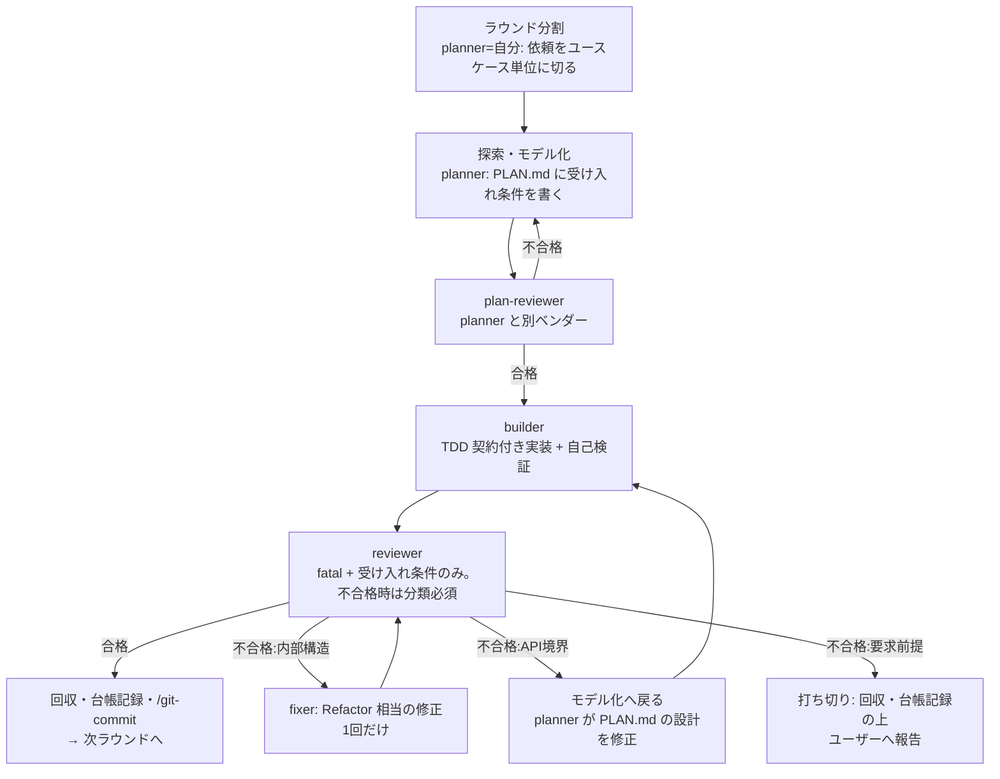

# round-slicer — seiren ループのマルチエージェント運転

## 概要

seiren の開発ループ（探索→モデル化→TDD→学習）を、herdr-multiagent-dev の役割分担（planner / builder / reviewer / fixer）に写像して回す合成スキル。自分（メインエージェント）は指揮者 + 学習判定者に専念し、実装とレビューは別ベンダーのエージェントに分担させる。核心は3つ:

1. **ラウンド分割**: 大きな依頼は planner がユースケース単位の「ラウンド」に切り、1ラウンド = seiren ループ一周として直列に回す
2. **分類付き合否**: reviewer の判定を二値（合格/不合格）から「不合格 + 分類」に拡張し、分類を seiren の戻り先（Refactor / モデル化 / 探索）へルーティングする
3. **有界ループ**: seiren のループは無限だが、無人運用では戻り回数とタイムボックスに上限を課す。「やめる判断」が品質担保

**REQUIRED BACKGROUND:** seiren（ループ意味論の正本）、herdr-multiagent-dev（役割設計・操縦・防御層・判定パースの正本）。開始前に `test "${HERDR_ENV:-}" = 1` を確認する。

## When to Use

- 複数ユースケースの開発を、実装とレビューを別エージェントに分担して半自動〜無人で進めたい
- seiren の規律（TDD・学習して戻る）を保ったままマルチエージェント化したい
- **使わない**: 自分1人で開発するなら seiren を直接使う。役割分担だけ欲しくループ規律が不要なら herdr-multiagent-dev を直接使う。単発の調査委譲は codex-investigate

## 全体フロー



各エッジの実行（起動・送信・受理検証・settled 待ち・回収）は herdr-multiagent-dev のセッションライフサイクルに従う。

## 段階 → 役割の写像

| seiren の段階 | 役割 | 担当 | 備考 |
|---|---|---|---|
| ラウンド分割・探索・モデル化 | planner | 自分 | PLAN.md に受け入れ条件を明記。計画の質が全ラウンドの上限になる |
| （計画の検証） | plan-reviewer | planner と別ベンダー | 受け入れ条件の検証可能性・スコープ妥当性のみ |
| Red-Green-Refactor | builder | cursor 等 | プロンプト契約で TDD を義務付け（下記） |
| 学習の判定（一次） | reviewer | builder と別ベンダー | fatal + 受け入れ条件 + 不合格時の分類 |
| 学習の判定（最終）・ルーティング | 自分 | — | reviewer の分類を鵜呑みにせず、根拠を読んで戻り先を最終決定する |
| Refactor への戻り | fixer | builder と同系 | **1回だけ**（herdr-multiagent-dev の規律を継承） |

**planner は常に自分が務め、`agents.yaml` の `planner` エントリは round-slicer では使わない**（自分がループの指揮・最終判定を握るのが本スキルの前提）。herdr-multiagent-dev の `agents.yaml` から使うのは plan-reviewer / builder / reviewer / fixer の4役の割当だけ。

### フォールバックと独立性

`agents.yaml` の役割リストは**候補リスト**であり、割当時（初回・フォールバック発動時とも）に次の独立性制約でフィルタし、満たさない候補はスキップして次へ進む:

- **plan-reviewer**: planner（= 自分）と別ベンダーであること。**本スキルは複数の CLI（claude / cursor-agent / codex）から実行されうるため、「自分のベンダー」は固定せず実行時に自認して判定する**（例: 自分が Claude 系なら `claude-code` 候補を、Codex 系なら `codex` 候補をスキップ）
- **reviewer**: そのラウンドで builder が**実際に使った**エージェントと別ベンダーであること（設定上の主担当ではなく、フォールバック後の実割当と比較する）
- **fixer**: 実際の builder と同系であること

制約を満たす候補が尽きたら、その役割は割当不能として**ラウンドを打ち切る**。独立性を毀損したまま無人で続行しない（クロスレビューの独立性が品質ゲートの核であるため）。

## 判定契約の拡張（分類付き独立行契約）

reviewer への契約: 「最終行に必ず次のいずれか**とだけ**書く。不合格の場合はその前に理由と根拠（該当ファイル・テスト結果）を箇条書き」:

```
合格
不合格:内部構造   … 受け入れ条件は満たすが実装の質に fatal がある → fixer
不合格:API境界    … インターフェース・境界の切り方が原因 → モデル化へ戻る
不合格:要求前提   … 受け入れ条件・要求自体に矛盾や誤りがある → 打ち切り・報告
```

パースは herdr-multiagent-dev の独立行契約（末尾行から走査、部分一致禁止）を分類対応に拡張する:

```typescript
const VERDICT_LINE = /^[•\-*\s]*(合格|不合格[:：](内部構造|API境界|要求前提))[。．\s]*$/;
// 一致なし・分類なしの「不合格」単独は「判定不明」= 不合格:内部構造 として扱い fixer 1回で確かめる
```

**分類はルーティングの提案であって決定ではない。** 自分が reviewer の理由・根拠を読み、誤分類（例: 実は設計問題なのに内部構造と報告）と判断したら戻り先を上書きする。上書きしたことと理由は台帳に記録する。

## builder への TDD 契約

herdr-multiagent-dev のプロンプト契約の型に、TDD の義務を追加する:

```
あなたは builder です。作業ディレクトリ: <絶対パス>
PLAN.md の受け入れ条件 <番号> を実装してください。
ルール:
- 先に受け入れ条件を失敗するテストで表現し、実行して失敗を確認してから実装する
- テストが通ったら、振る舞いを変えずに内部を整理する（Refactor）
- スコープ外のファイルに触らない: <限定リスト>
- 完了前に <テストコマンド> を実行して全件通ることを確認
完了報告には、実行したテストコマンドとその結果の要約を含め、
最終行に「実装完了」とだけ書いてください。
```

## 有界ループの規律

seiren は「問題なしと言えるまでループを抜けない」が、無人運用では上限が要る:

| 戻り先 | 上限 | 超過時 |
|---|---|---|
| fixer（内部構造） | ラウンドあたり 1回 | 打ち切り |
| モデル化（API境界） | ラウンドあたり 1回 | 打ち切り |
| 探索（要求前提） | 0回（即打ち切り） | 要求の問題は無人で解けない。ユーザーへ報告 |
| plan-reviewer 不合格 | 2回 | 打ち切り |

- 打ち切りは失敗ではなく**正常な終了経路**。ラウンドを失敗として台帳に記録し、後続ラウンドが独立なら続行、依存するなら全体を止めてユーザーへ報告する
- **打ち切り時も回収・片付けを省かない**: 起動中の全ペインについてログ退避 → pane close を行う（herdr-multiagent-dev のライフサイクルに従う）。ここを省くとペインが残留し、失敗原因の調査材料も失われる
- ラウンド全体のタイムボックス（例: 2時間）は herdr-multiagent-dev のセッション規律を継承する

## 台帳

herdr-multiagent-dev の台帳（役割→エージェント+モデル）に加え、ラウンドごとに記録する:

- ラウンド ID・対象ユースケース・結果（合格 / 打ち切り:分類）
- 戻りの履歴（reviewer の分類、自分が上書きした場合はその理由）
- フォールバックの履歴（発動理由と、独立性制約でスキップした候補）
- 分類別の頻度はスキル改善の根拠になる: API境界での戻りが多いなら planner の設計精度、内部構造が多いなら builder への契約を疑う

## 次のステップ

合格したラウンドは `/git-commit` でコミットしてから次ラウンドへ。全ラウンド完了で必要なら `/create-pr` へ繋ぐ。
